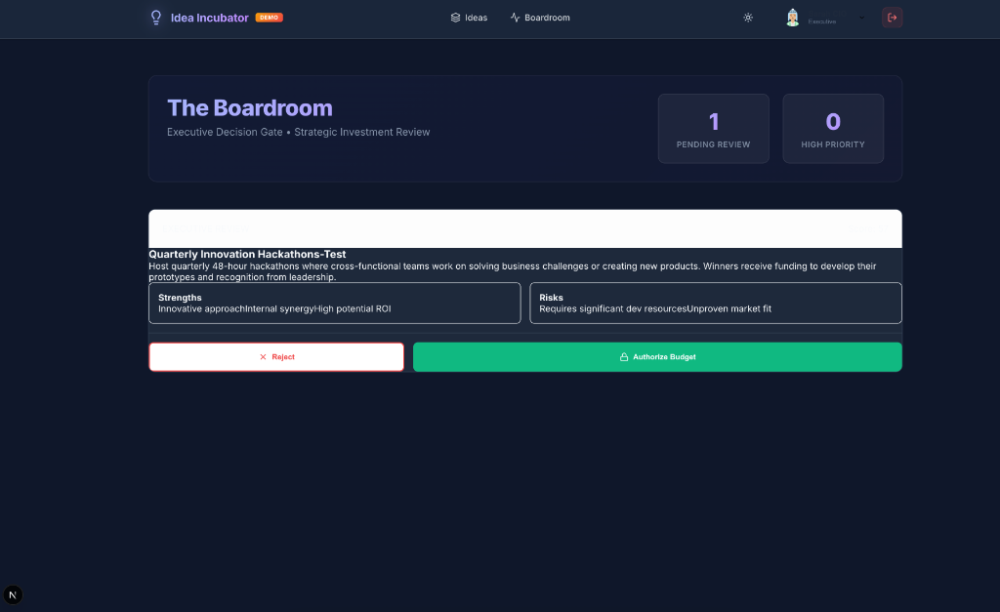
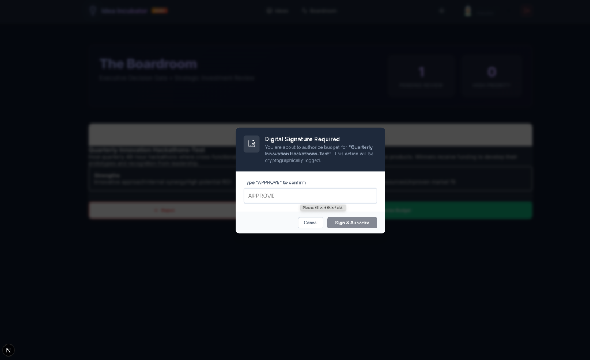
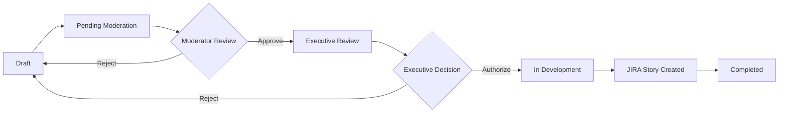

# 💡 Idea Incubator

> **Transform innovative concepts into reality. Where history's giants inspire tomorrow's pioneers.**

[](http://localhost:3000)
[](LICENSE)
[](https://nextjs.org/)
[](https://www.typescriptlang.org/)
[](https://www.prisma.io/)


## 📚 Table of Contents

- [Overview](#-overview)
- [Features](#-features)
- [Screenshots](#-screenshots)
- [Getting Started](#-getting-started)
- [User Roles](#-user-roles)
- [Workflow](#-workflow)
- [JIRA Integration](#-jira-integration)
- [Tech Stack](#-tech-stack)
- [Installation](#-installation)
- [Configuration](#-configuration)
- [Usage](#-usage)
- [API Documentation](#-api-documentation)
- [Contributing](#-contributing)
- [License](#-license)

## 🌟 Overview

**Idea Incubator** is an enterprise-grade innovation management platform that streamlines the entire lifecycle of employee ideas—from initial submission to JIRA story creation. Built with modern web technologies, it provides a seamless experience for employees, moderators, executives, and administrators.

### Key Highlights

- ✨ **Intuitive Submission** - Easy-to-use interface for sharing innovative concepts
- 🗳️ **Community Voting** - Democratic prioritization through peer voting
- 🔍 **Smart Moderation** - Efficient review and approval workflows
- 💼 **Executive Dashboard** - Strategic decision-making with SWOT analysis
- 📊 **Real-time Analytics** - Comprehensive metrics and conversion tracking
- 🔗 **JIRA Integration** - Automatic story creation upon approval
- 🎨 **Modern UI/UX** - Beautiful dark mode with glassmorphism effects
- 📱 **Fully Responsive** - Optimized for desktop, tablet, and mobile

## ⚡ Features

### For Everyone
- **Innovation Pipeline** - View all ideas in a comprehensive dashboard
- **Voting System** - Support great ideas with one-click voting
- **Trending Sidebar** - See what's hot in the innovation community
- **Search & Filter** - Find ideas by category, status, or submitter
- **Dark/Light Mode** - Toggle between themes for comfortable viewing

### For Employees (Innovators)
- Submit ideas with rich descriptions
- Track idea progress through the pipeline
- Edit submissions before moderation
- Vote on colleagues' ideas
- View personal contribution history

### For Moderators
- **Control Tower Dashboard** - Queue of pending ideas
- Approve or reject with feedback
- Bulk actions for efficiency
- Status tracking and reporting
- Comment and collaborate

### For Executives
- **The Boardroom** - Strategic review interface
- AI-powered SWOT analysis
- Digital signature authorization
- Budget allocation tools
- High-priority idea tracking
- Automatic JIRA story creation

### For Administrators
- **Mission Control** - System-wide analytics
- Real-time metrics dashboard
- Conversion funnel tracking
- JIRA integration configuration
- User management
- Export capabilities

## 📸 Screenshots

### Login & Authentication

*Modern login interface with test account shortcuts for all roles*

### Main Dashboard

*Innovation Pipeline with ideas, voting, trending sidebar, and historical innovators banner*

### Moderation

*Moderator dashboard for reviewing and approving submissions*

### Executive Review

*Executive dashboard with SWOT analysis and strategic decision tools*


*Digital signature modal for budget authorization*

## 🚀 Getting Started

### Prerequisites

- Node.js 18+ and npm
- SQLite (for development) or PostgreSQL (for production)
- JIRA Cloud account (optional, for integration)

### Quick Start

```bash
# Clone the repository
git clone https://github.com/yourcompany/idea-incubator.git
cd idea-incubator

# Install dependencies
npm install

# Set up environment variables
cp .env.example .env

# Initialize database
npx prisma migrate dev
npx prisma db seed

# Start development server
npm run dev
```

Visit [http://localhost:3000](http://localhost:3000) to see the application.

### Test Accounts

Use these test accounts to explore different roles:

| Role | Email | Quick Login |
|------|-------|-------------|
| **Employee** | emma@company.com | Click "Employee" button |
| **Moderator** | mike@company.com | Click "Moderator" button |
| **Executive** | sarah@company.com | Click "Executive" button |
| **Admin** | alice@company.com | Click "Admin" button |

## 👥 User Roles

### 🔵 Employee (Innovator)
**Permissions:**
- Submit ideas
- Vote on ideas
- View all ideas
- Track own submissions

**Key Features:**
- Idea submission form
- Voting system
- Trending ideas sidebar

### 🟣 Moderator
**Permissions:**
- All Employee permissions
- Review submissions
- Approve/reject ideas
- Access Control Tower

**Key Features:**
- Moderation dashboard
- Bulk actions
- Review queue management

### 🔴 Executive
**Permissions:**
- All Employee permissions
- Access Boardroom
- Approve budgets
- Digital signatures
- SWOT analysis

**Key Features:**
- Executive dashboard
- Strategic review tools
- Budget authorization
- JIRA story creation

### 🟡 Admin
**Permissions:**
- All permissions
- System configuration
- JIRA integration setup
- Analytics access
- User management

**Key Features:**
- Mission Control dashboard
- Integration settings
- Real-time analytics
- Conversion funnel

## 🔄 Workflow

### Idea Lifecycle



### Stage 1: Submission (Employee)
1. Employee submits idea with title, description, category, and t-shirt size
2. Idea enters "Pending Moderation" status
3. Other employees can view and vote

### Stage 2: Moderation (Moderator)
1. Moderator reviews idea in Control Tower
2. Can approve (→ Executive Review) or reject (→ Draft)
3. Provides feedback and comments

### Stage 3: Executive Review (Executive)
1. Executive views idea in The Boardroom
2. Analyzes SWOT (Strengths, Weaknesses, Opportunities, Threats)
3. Reviews business value score and community votes
4. Authorizes budget with digital signature

### Stage 4: Development (System)
1. Automatic JIRA story creation
2. Idea status changes to "In Development"
3. JIRA ticket ID linked to idea
4. Development team begins implementation

## 🔗 JIRA Integration

### Setup Instructions

1. **Generate API Token**
   - Visit [Atlassian Account Settings](https://id.atlassian.com/manage-profile/security/api-tokens)
   - Create a new API token
   - Copy it immediately (won't be shown again)

2. **Configure Integration**
   - Log in as Admin
   - Navigate to Mission Control → Settings tab
   - Fill in:
     - **JIRA Instance URL**: `https://yourcompany.atlassian.net`
     - **Project Key**: Your project key (e.g., `INNO`, `IDEA`)
     - **Email Address**: Your JIRA account email
     - **API Token**: Paste the token from step 1

3. **Test Integration**
   - Click "Save Configuration"
   - Approve a test idea to verify

### What Gets Created

When an executive authorizes a budget, the system creates a JIRA story with:

- **Summary**: Idea title
- **Description**: Full idea description with metadata
- **Submitter**: Original idea author
- **Category**: Product, Process, or Culture
- **Business Value Score**: ROI assessment
- **T-Shirt Size**: Effort estimate (S, M, L, XL)
- **Labels**: `innovation`, `idea-incubator`, category tag

### Troubleshooting

| Issue | Solution |
|-------|----------|
| `SYNC-FAILED` ticket ID | Check JIRA configuration in Admin settings |
| `401 Unauthorized` | API token expired or incorrect |
| `400 Bad Request` | Invalid project key or issue type not available |
| `DEMO-XXXX` ticket ID | JIRA not configured (demo mode) |

## 🛠️ Tech Stack

### Frontend
- **Framework**: Next.js 16.0 (App Router)
- **Language**: TypeScript 5.0
- **Styling**: CSS Modules with custom design system
- **Icons**: Lucide React
- **Animations**: Framer Motion

### Backend
- **Runtime**: Node.js 18+
- **API**: Next.js API Routes (Server Actions)
- **Database ORM**: Prisma 5.22
- **Database**: SQLite (dev) / PostgreSQL (prod)

### Integrations
- **JIRA**: REST API v3 with Basic Auth
- **Authentication**: Cookie-based sessions

### Development Tools
- **Package Manager**: npm
- **Linting**: ESLint
- **Type Checking**: TypeScript
- **Database Migrations**: Prisma Migrate

## 📦 Installation

### Development Setup

```bash
# Install dependencies
npm install

# Set up environment variables
cp .env.example .env

# Configure database
DATABASE_URL="file:./prisma/dev.db"

# Run migrations
npx prisma migrate dev --name init

# Seed database with sample data
npx prisma db seed

# Generate Prisma Client
npx prisma generate

# Start development server
npm run dev
```

### Production Deployment

```bash
# Build for production
npm run build

# Start production server
npm start
```

### Environment Variables

Create a `.env` file in the root directory:

```env
# Database
DATABASE_URL="file:./prisma/dev.db"

# JIRA Integration (Optional)
NEXT_PUBLIC_JIRA_DOMAIN="yourcompany.atlassian.net"

# Application
NODE_ENV="development"
```

## ⚙️ Configuration

### Database Schema

The application uses Prisma with the following main models:

- **User**: User accounts with roles
- **Idea**: Innovation submissions
- **Vote**: User votes on ideas
- **Review**: Moderation and executive reviews
- **IntegrationConfig**: JIRA and other integration settings

### Prisma Commands

```bash
# Create a new migration
npx prisma migrate dev --name your_migration_name

# Reset database
npx prisma migrate reset

# Open Prisma Studio
npx prisma studio

# Generate Prisma Client
npx prisma generate

# Seed database
npx prisma db seed
```

## 📖 Usage

### Submitting an Idea

1. Log in as an Employee
2. Click "Submit New Idea" button
3. Fill in the form:
   - **Title**: Clear, concise idea name
   - **Description**: Detailed explanation
   - **Category**: Product, Process, or Culture
   - **T-Shirt Size**: S, M, L, or XL
   - **Risk Mitigation**: How to minimize risks
   - **Executive Sponsor**: Select a sponsor
4. Click "Submit"

### Voting on Ideas

1. Browse the Innovation Pipeline
2. Click the vote button (👍) next to any idea
3. Vote count updates in real-time
4. View trending ideas in the sidebar

### Moderating Ideas

1. Log in as Moderator
2. Navigate to Control Tower
3. Review pending ideas
4. Click "Approve" or "Reject"
5. Add comments for feedback

### Authorizing Budgets

1. Log in as Executive
2. Navigate to The Boardroom
3. Click on an idea to view details
4. Review SWOT analysis
5. Click "Authorize Budget"
6. Type "APPROVE" in the signature modal
7. Click "Sign & Authorize"
8. JIRA story is automatically created

## 📚 API Documentation

### Server Actions

#### Authentication
- `loginUser(userId: string)` - Log in a user
- `logoutUser()` - Log out current user
- `getCurrentUser()` - Get current user session

#### Ideas
- `submitIdea(formData: FormData)` - Submit a new idea
- `updateIdea(id: string, formData: FormData)` - Update an idea
- `checkIdea(id: string)` - Check idea status

#### Moderation
- `approveIdea(id: string)` - Approve an idea for executive review
- `rejectIdea(id: string, reason: string)` - Reject an idea

#### Executive
- `approveStrategy(id: string, sizing: string, notes: string)` - Authorize budget
- `rejectStrategy(id: string, reason: string)` - Reject strategy
- `generateSWOT(description: string)` - Generate SWOT analysis

#### JIRA
- `createJiraStoryForIdea(ideaId: string)` - Create JIRA story
- `saveJiraConfig(formData: FormData)` - Save JIRA configuration
- `getJiraConfig()` - Get JIRA configuration

## 🤝 Contributing

We welcome contributions! Please follow these steps:

1. Fork the repository
2. Create a feature branch (`git checkout -b feature/amazing-feature`)
3. Commit your changes (`git commit -m 'Add amazing feature'`)
4. Push to the branch (`git push origin feature/amazing-feature`)
5. Open a Pull Request

### Development Guidelines

- Follow TypeScript best practices
- Use CSS Modules for styling
- Write descriptive commit messages
- Add comments for complex logic
- Test thoroughly before submitting PR

## 📄 License

This project is licensed under the MIT License - see the [LICENSE](LICENSE) file for details.

## 🙏 Acknowledgments

- Inspired by historical innovators: Einstein, Newton, Marie Curie, Leonardo da Vinci
- Built with modern web technologies
- Designed for enterprise innovation management


---

<div align="center">
  <p><strong>Made with ❤️ by the Innovation Team</strong></p>
  <p><em>Where history's giants inspire tomorrow's pioneers</em></p>
</div>
